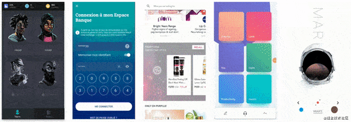

# KCFlutter

### 一、🎅Flutter-从入门到项目 这个专题由来🎅 

`Flutter` 相信大家已经不再陌生了! 在 2018-2020 无论从实际开发到面试,`Flutter`已经走入移动开发 (`Android / iOS`). 本人针对 `Flutter` 的表现, 真心觉得 `Flutter` 有必要真正掌握. 可能很多开发人员觉得学习一门新的语言是一件比较难的事情,其实不然.只要你掌握好了你目前主流语言 , 甚至都不需要掌握很底层 你都可以很轻松入门 `Flutter` (主要是容易学). 但是很难坚持,所以为了大家更好的体验效果,我花了一定时间给大家整理了这么一个专栏 **`Flutter 从入门到offer`**  希望你能够喜欢.

### 二、🎅Flutter-从入门到项目 已更新🎅 

[Flutter-从入门到项目 01: Flutter重要性](https://juejin.cn/post/6907217804764643336) 

[Flutter-从入门到项目 02: 环境配置](https://juejin.cn/post/6907607707549696013)

[Flutter-从入门到项目 03: Flutter初体验](https://juejin.cn/post/6909347907321724942)

> 持续更新中,喜欢的可以点赞收藏.